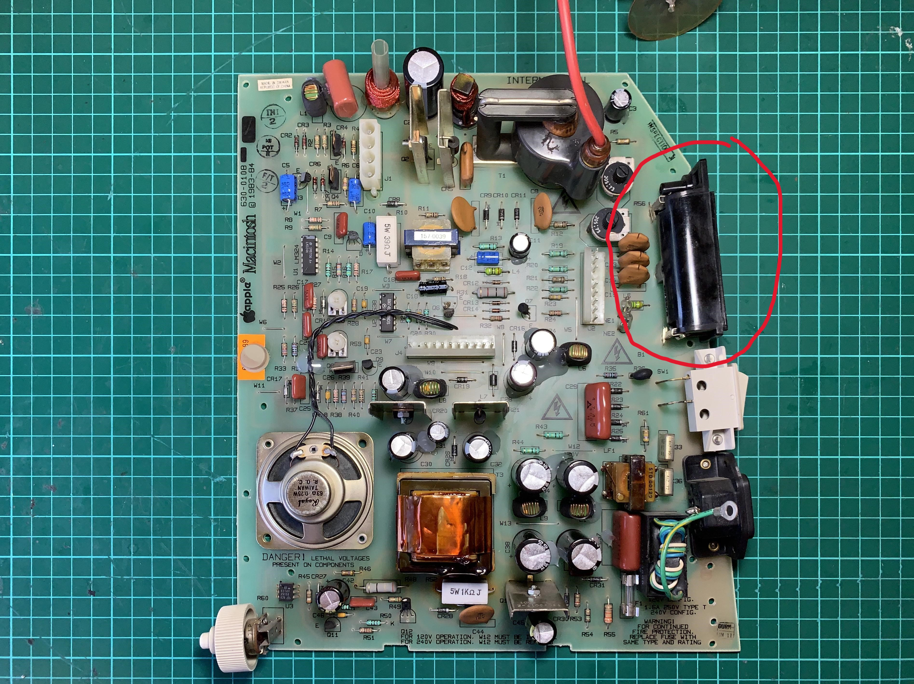

# Macintosh 128k/512k/Plus 14500 battery-socket

## What
This printable is a drop-in replacement for the Macintosh 128k/512k/Plus batterysocket.
Also known as part "CAPETRONIC DS 1011" and "815-0727-B".
This replacement batterysocket is based on a 14500 3.7V rechargeable battery which is enough to keep the clock running and save the PRAM settings.

## Location
The location of the switch is marked as "B1".

## Printing
- [x] Print with 15% infill. Support not needed, but can be used.

## Used parts
- [x] 3.7V 14500 battery (rechargeable) 
- [x] 1AA/14500 socket [Link (20pc)](https://nl.aliexpress.com/item/1005004854188605.html)
- [x] 2x 8MM M3 flathead bolt [Link](https://nl.aliexpress.com/item/1005004086739002.html)
- [x] 2x M3 (hex)nut [Link](https://nl.aliexpress.com/item/1005003780212966.html)
- [x] 3x 3x8MM screw (for board fixing) [Link](https://nl.aliexpress.com/item/1005005830148342.html)
- [x] 2x 25MM 18AWG solidcore wire [Link](https://nl.aliexpress.com/item/1005004635987651.html)

## How to
- Print the model.
- Solder on each ends of the 14500 socket a 25mm 18AWG wire.
- Insert the batterysocket into the printed bracket, and bend the 18AWG wires 90 degrees downwards into the slot on the backside of the bracket.
- Fix the batterysocket with 2x flathead 8MM M3 blots.
- Place the bracket on the board, guide the two wires into the analogboard solderpads, and secure it with 3 3x8MM screws to the analogboard.
- Solder the leads to the analogboard.

## Disclaimer
I will not be held liable for damages, injury or even death resulting from this part. Build and use this part only at your own risk.

